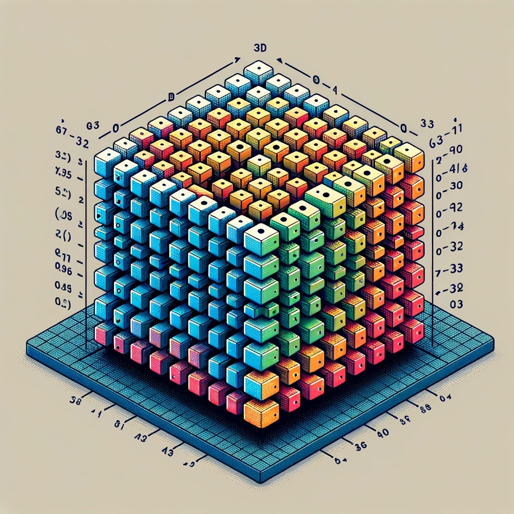

This is a series of lessons focused on Python lists, dictionaries, and tensors. We'll start with the basics of each and gradually build up to more complex operations and use cases. This approach will not only help you understand these data structures in Python but also prepare you for their use in machine learning and neural networks. Let's begin!

### Lesson 1: Python Lists

#### Introduction to Lists
- Lists in Python are ordered collections of items (elements) that can hold a variety of data types. They are mutable, meaning you can change their content without changing their identity.

#### Creating a List
```python
# Creating a simple list
simple_list = [1, 2, 3, 4, 5]
print("Simple List:", simple_list)

# List with mixed data types
mixed_list = [1, "Hello", 3.14, [1, 2, 3]]
print("Mixed List:", mixed_list)
```

#### Accessing List Elements
- You can access elements in a list by their index. Python uses zero-based indexing.

```python
# Accessing elements
first_element = simple_list[0]
print("First Element:", first_element)

# Negative indexing
last_element = simple_list[-1]
print("Last Element:", last_element)
```

#### Modifying a List
- Lists can be modified by assigning new values to elements, adding new elements, or removing existing ones.

```python
# Modifying an element
simple_list[0] = 100
print("Modified List:", simple_list)

# Adding an element
simple_list.append(6)
print("List after append:", simple_list)

# Removing an element
del simple_list[1]
print("List after deletion:", simple_list)
```

#### List Comprehensions
- List comprehensions provide a concise way to create lists.

```python
# Squares of numbers from 1 to 5
squares = [x**2 for x in range(1, 6)]
print("Squares:", squares)
```

#### Practice Exercise
- Create a list of your favorite fruits.
- Add a new fruit to the list.
- Replace the second fruit in the list with another fruit.
- Print the list of fruits.

---


### Lesson 2: Python Dictionaries

#### Introduction to Dictionaries
- Dictionaries in Python are unordered collections of items. Each item in a dictionary is a key-value pair. Dictionaries are indexed by keys, which can be any immutable type, and the values can be of any data type.

#### Creating a Dictionary

```python
# Creating a simple dictionary
simple_dict = {'name': 'Alice', 'age': 25, 'city': 'New York'}
print("Simple Dictionary:", simple_dict)

# Dictionary with mixed value types
mixed_dict = {'name': 'Bob', 'is_student': True, 'grades': [88, 90, 92]}
print("Mixed Dictionary:", mixed_dict)
```

#### Accessing Dictionary Values
- Values in a dictionary can be accessed using their corresponding keys.

```python
# Accessing a value
name = simple_dict['name']
print("Name:", name)

# Using get() method to access a value
age = simple_dict.get('age')
print("Age:", age)
```

#### Modifying a Dictionary
- You can change the value of an existing key, add new key-value pairs, or remove key-value pairs.

```python
# Modifying a value
simple_dict['age'] = 26
print("Modified Dictionary:", simple_dict)

# Adding a new key-value pair
simple_dict['profession'] = 'Engineer'
print("Dictionary after addition:", simple_dict)

# Removing a key-value pair
del simple_dict['city']
print("Dictionary after deletion:", simple_dict)
```

#### Iterating Over a Dictionary
- You can iterate over the keys, values, or key-value pairs in a dictionary.

```python
# Iterating over keys
for key in simple_dict:
    print(key)

# Iterating over values
for value in simple_dict.values():
    print(value)

# Iterating over key-value pairs
for key, value in simple_dict.items():
    print(key, ":", value)
```

#### Practice Exercise
- Create a dictionary to store information about a book (like title, author, and publication year).
- Update the author's name.
- Add a new key-value pair for the genre of the book.
- Remove the publication year.
- Print the final dictionary.

---

### Lesson 3: Introduction to Tensors

#### What are Tensors?
- Crucial in neural networks and machine learning. 
- Tensors are a generalization of matrices to higher dimensions. In machine learning and neural networks, they are often used to represent complex data like images, sounds, and other inputs.
- In Python, we typically use the NumPy library to work with tensors, as it provides a powerful and efficient way to handle large, multi-dimensional arrays (which are essentially tensors).

Lists and dictionaries in Python can play a significant role in working with tensors, especially in the context of data preparation, manipulation, and management in machine learning and AI applications. Let's delve into how they intersect:

### Lists and Tensors
1. **Data Representation**: In Python, lists can be used to represent tensors, particularly when you're dealing with them at a basic level. For example, a 2D tensor (like a matrix) can be represented as a list of lists, and a 3D tensor as a list of list of lists.

    ```python
    # Representing a 2D tensor (matrix) using lists
    matrix = [[1, 2, 3], [4, 5, 6], [7, 8, 9]]

    # Representing a 3D tensor using lists
    tensor_3d = [[[1, 2], [3, 4]], [[5, 6], [7, 8]], [[9, 10], [11, 12]]]
    ```

2. **Data Manipulation**: Lists are often used for initial data manipulation before converting the data into tensor format, which is required by most machine learning frameworks. Operations like appending, slicing, and iterating are commonly performed on lists.

3. **Conversion to Tensors**: In libraries like NumPy, TensorFlow, or PyTorch, lists are commonly converted to tensor objects for more efficient and advanced operations.
   
    ```python
    # Using NumPy to convert a list to a tensor
    import numpy as np
    np_tensor = np.array(matrix)
    ```

### Dictionaries and Tensors
1. **Organizing Data**: Dictionaries in Python are extremely useful for organizing and accessing tensor data in a structured way. For instance, when working with a dataset, you might use dictionaries to map labels to their corresponding tensor data.

    ```python
    # Organizing tensor data with labels
    dataset = {
        "image_1": tensor_1,
        "image_2": tensor_2,
    }
    ```

2. **Batch Processing**: In machine learning, especially in deep learning, data is often processed in batches. Dictionaries can be used to hold batches of data where each key might represent a different aspect of the data, like features and labels.

    ```python
    # Holding a batch of data
    batch = {
        "features": batch_features,  # Tensor of features
        "labels": batch_labels      # Tensor of labels
    }
    ```

3. **Parameter Management**: In neural network models, parameters like weights and biases can be stored in dictionaries for organized access and manipulation.

    ```python
    # Storing model parameters
    parameters = {
        "weights": weights_tensor,
        "biases": biases_tensor
    }
    ```

### In Summary
Lists and dictionaries are not just fundamental data structures in Python; they are also crucial in the context of handling and organizing tensor data in machine learning workflows. They provide a way to manage tensor data before and after it is transformed into the more complex structures required for machine learning models.

---

# Creating Tensors

#### Setting Up NumPy
First, make sure you have NumPy installed. You can install it using pip:

```bash
pip install numpy
```

#### Creating Tensors with NumPy

```python
import numpy as np

# Creating a 1D tensor (vector)
vector = np.array([1, 2, 3])
print("Vector:\n", vector)

# Creating a 2D tensor (matrix)
matrix = np.array([[1, 2, 3], [4, 5, 6]])
print("\nMatrix:\n", matrix)

# Creating a 3D tensor
tensor_3d = np.array([[[1, 2], [3, 4]], [[5, 6], [7, 8]]])
print("\n3D Tensor:\n", tensor_3d)
```

#### Accessing Elements in Tensors
- Similar to lists and arrays, you can access elements in tensors using indexing.

```python
# Accessing an element in a matrix
element = matrix[1, 2]  # Row index 1, Column index 2
print("Accessed Element:", element)

# Slicing a tensor
slice_ = tensor_3d[:, 1, :]
print("\nSliced Tensor:\n", slice_)
```

#### Basic Operations on Tensors
- NumPy provides a wide range of operations that can be performed on tensors.

```python
# Element-wise addition
result_add = matrix + vector
print("Addition:\n", result_add)

# Element-wise multiplication
result_mul = matrix * vector
print("\nMultiplication:\n", result_mul)

# Matrix multiplication
result_matmul = np.dot(matrix, vector.reshape(3, 1))
print("\nMatrix Multiplication:\n", result_matmul)
```

#### Practice Exercise
- Create a 2D tensor (matrix) representing a 3x3 grid.
- Multiply each element by 2.
- Calculate the transpose of the matrix.
- Print the original and the transposed matrices.

---

### Next Steps
We've covered the basics of lists, dictionaries, and tensors in Python. These are foundational concepts, especially when moving towards more advanced topics like building neural networks. Tensors, in particular, are a cornerstone in data representation for machine learning.

Feel free to experiment with the practice exercises and explore more NumPy operations. 

The following is a critical thinking exercise that integrates Python lists, dictionaries, and tensors (using NumPy) in a meaningful way. We'll create a mini-project that simulates a very basic aspect of a machine learning task. The project will involve creating a dataset, manipulating it, and preparing it for a hypothetical machine learning model.

### Mini-Project: Building a Simple Image Dataset and Preprocessor

#### Project Overview
You will create a simple image dataset, where each "image" is represented as a 2D tensor (matrix) with numerical values. These images will be stored in a dictionary with labels. You'll then write functions to manipulate these images (e.g., normalization, flattening) to prepare them for input into a machine learning model.

#### Step 1: Create the Image Dataset
- Each image will be a 3x3 matrix with values ranging from 0 to 255 (simulating pixel values in a grayscale image).
- Images will be labeled as either 'Category_A' or 'Category_B' (stored in a dictionary).

#### Step 2: Implement Preprocessing Functions
1. **Normalization Function**: Normalizes the image data to be between 0 and 1.
2. **Flattening Function**: Converts each 2D image into a 1D vector (flattens it).

#### Step 3: Apply Preprocessing and Organize Data
- Apply the preprocessing functions to each image in the dataset.
- Organize the processed data into a list of tuples, each containing the flattened image and its label.

#### Getting Started: 
```python
import numpy as np
```
#### Preprocessing Functions
```python
def normalize(image):
    return image / 255

def flatten(image):
    return image.flatten()
```

#### Creating the Dataset
```python
# Create a few sample images
image1 = np.random.randint(0, 256, (3, 3))
image2 = np.random.randint(0, 256, (3, 3))
# ... create more images if needed
print("image1 is:" , image1)
print("image2 is:" , image2)
# Label the images and store them in a dictionary
# Ensure all entries are actual images or remove the ellipsis
dataset = {
    'Category_A': [image1],  # Add more images as needed
    'Category_B': [image2]   # Add more images as needed
}
```

#### Applying Preprocessing and Organizing Data

```python
processed_data = []
for label, images in dataset.items():
    for img in images:
        normalized_img = normalize(img)
        flattened_img = flatten(normalized_img)
        processed_data.append((flattened_img, label))
```

###We don't need to supply actual image files for this particular code snippet. The code is simulating image data using NumPy arrays. Let me explain how it works:

1. **Creating Sample Images with NumPy:**
   The `np.random.randint(0, 256, (3, 3))` function is used to create 3x3 matrices with random integers between 0 and 255. These matrices are serving as stand-ins for actual image data. Each element in the matrix can be thought of as a pixel value in a grayscale image (where 0 represents black and 255 represents white).

    ```python
    image1 = np.random.randint(0, 256, (3, 3))
    image2 = np.random.randint(0, 256, (3, 3))
    ```

2. **Storing Images in a Dictionary:**
   These matrices (`image1`, `image2`, etc.) are then stored in a dictionary under different categories. This mimics a common scenario in machine learning where you have a dataset of images categorized (or labeled) in some way.

    ```python
    dataset = {'Category_A': [image1], 'Category_B': [image2]}
    ```

3. **Processing the Images:**
   The `normalize` and `flatten` functions are typical preprocessing steps in machine learning. Normalizing scales the pixel values to be between 0 and 1, and flattening converts the 2D matrix of an image into a 1D array. These steps are often necessary to prepare the data for input into a machine learning model.

    ```python
    for label, images in dataset.items():
        for img in images:
            normalized_img = normalize(img)
            flattened_img = flatten(normalized_img)
            processed_data.append((flattened_img, label))
    ```

####In summary, the code is a simulation of how one might process image data for machine learning, but it uses randomly generated data instead of actual images. This approach is useful for learning and testing algorithms when you don't have access to a real dataset or when you're focusing on understanding the processing steps.
---
###Here's the full program with explanatory comments included:

```python
import numpy as np

# Function to normalize image data
def normalize(image):
    # Normalize the image data to be between 0 and 1
    return image / 255

# Function to flatten image data
def flatten(image):
    # Flatten the 2D image into a 1D array
    return image.flatten()

# Creating sample images using NumPy
# np.random.randint generates a 3x3 matrix of random integers between 0 and 255
# Each matrix simulates a grayscale image where each element is a pixel value
image1 = np.random.randint(0, 256, (3, 3))  # Random 3x3 image
image2 = np.random.randint(0, 256, (3, 3))  # Another random 3x3 image

# Storing the images in a dictionary under different categories
# In a real scenario, these categories would correspond to different classes of images
dataset = {
    'Category_A': [image1],  # List of images in Category A
    'Category_B': [image2]   # List of images in Category B
}
print("The dataset is:", dataset)

# Processed data will be stored in this list
processed_data = []

# Iterating over each category and image in the dataset
for label, images in dataset.items():
    for img in images:
        # Normalize and flatten each image
        normalized_img = normalize(img)
        flattened_img = flatten(normalized_img)

        # Append the processed image and its label to the processed_data list
        processed_data.append((flattened_img, label))
print("The processed data is:", processed_data)
# At this point, processed_data contains normalized and flattened images
# along with their corresponding labels
```

####This code provides a basic structure for simulating image data preprocessing in Python, which is a common task in machine learning workflows. The comments explain each part of the code to make it clear how the simulated image data is being created and processed.
---

## Critical Thinking Challenges
1. **Data Augmentation**: Implement a function to rotate the images by 90 degrees. Augment the dataset with these rotated images.
2. **Explore More Preprocessing**: Implement a function to apply a threshold to the images, turning them into binary (black and white) images.
3. **Data Analysis**: Write code to find the average pixel value across all images in a category.
4. **Scalability**: Consider how you would handle a much larger dataset. What changes or improvements would you make to your code?

This project not only reinforces your understanding of lists, dictionaries, and tensors but also introduces you to data preprocessing concepts in machine learning. As you work through it, you'll encounter practical challenges and decisions similar to those in real-world machine learning tasks. Enjoy the process, and feel free to ask questions or seek clarifications as needed!

